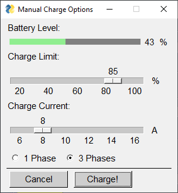

# EV-SmartCharge 'EVS-1'

**This file and project are under construction**

## Purpose

A smart EV vehicle charging solution using as much of free solar power as available.  It uses remainig solar power besides other higher priority power consumers like heatpumps and other household equipment.  The system can operate autonomously and also manually as remote control.

This solution uses the awsome  [go-eCharger](https://go-e.co/)

## Preconditions

Default configuration:

- [Renault ZOE](https://de.renault.ch/elektroautos/renault-zoe.html) Version from 2020++

- [go-eCharger](https://go-e.co/produkte/go-echarger-home/) Wallbox Version CM-03 with API V2 
  (older version vithout 1/ 3 phase switch only). 11kW or 22kW

- [SolarEdge](https://www.solaredge.com/homeowner-new) photovoltaic installation.

- WiFi and Internet connection 

Layered software archictecture allows adapting to different configurations, car and equipment.

## Functionality

EVS-1 is a Python software running on different systems including Windows, Linux and Raspberry-Pi computers.  

EVS-1 uses surplus energy of photovoltaic installations. Depending on solar power and car type, the system adjusts optimal charging power and switches autonomously from 1 phaes to 3 phases.

## Open Source

This software may be reused and adapted by respecting the MIT License. This project is based in parts on other open source projects:

[pysmplegui](https://pysimplegui.readthedocs.io/en/latest/) graphical interface tool

[go-eCharger API V2](https://github.com/goecharger/go-eCharger-API-v2)  WLAN or Internet access to the go-eCharger Wallbox

[SolarEdge API](https://www.solaredge.com/sites/default/files/se_monitoring_api.pdf)

[zozo](https://github.com/niosega/zozo) Renault ZOE server access library, modified

## Preiliminary Screenshots

### Main Window

### PV Settings

### Manual Charge Settings

